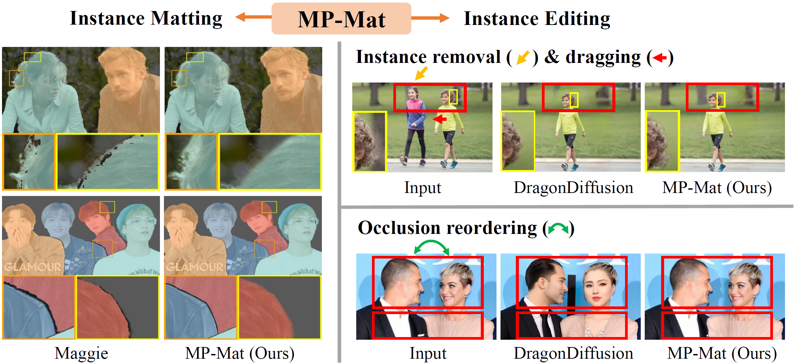

# MP-Mat: A 3D and Instance-Aware Human Matting and Editing Framework with Multiplane Representation (ICLR 2025)

This repository contains the official implementation of the ICLR 2025 paper "MP-Mat: A 3D and Instance-Aware Human Matting and Editing Framework with Multiplane Representation".

🔥🔥🔥 The code is currently being organized and will be open-sourced before April 25th — just in time for our poster session at ICLR 2025! Stay tuned!
